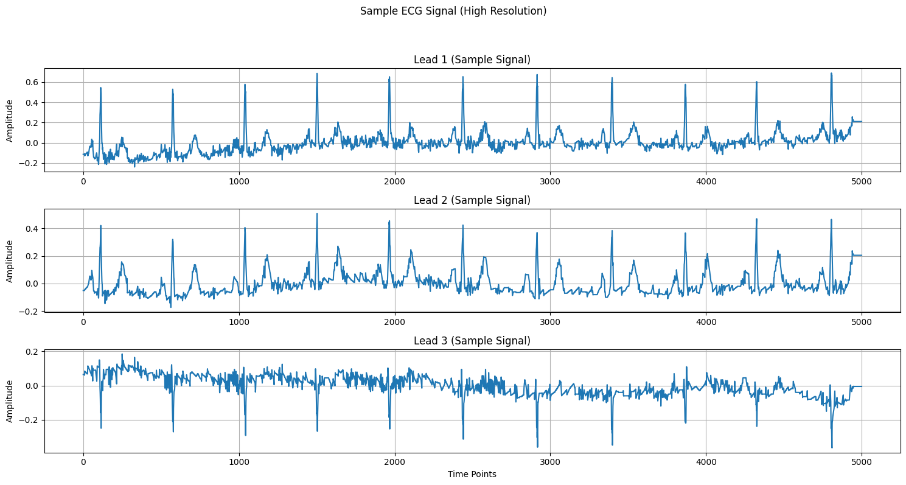
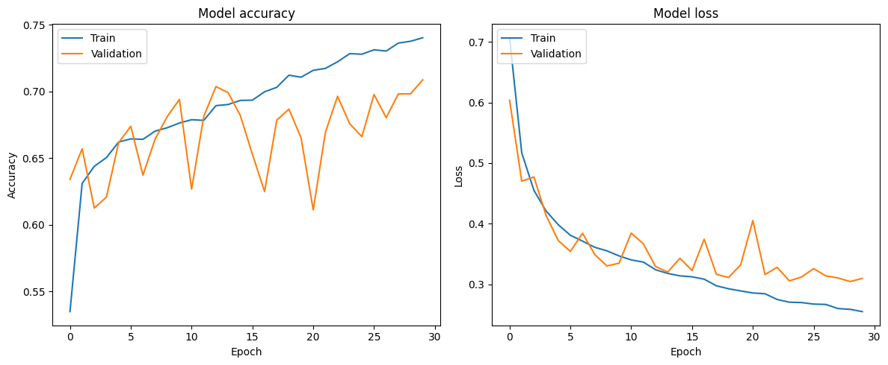
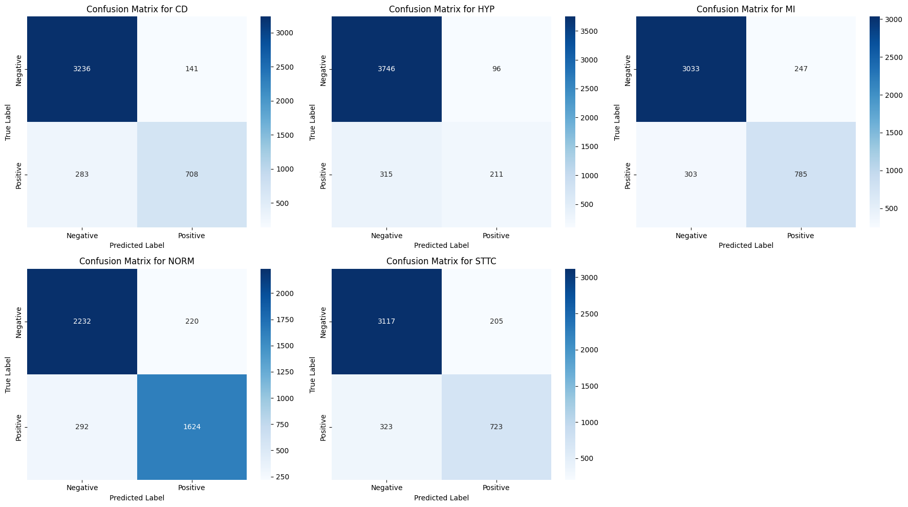
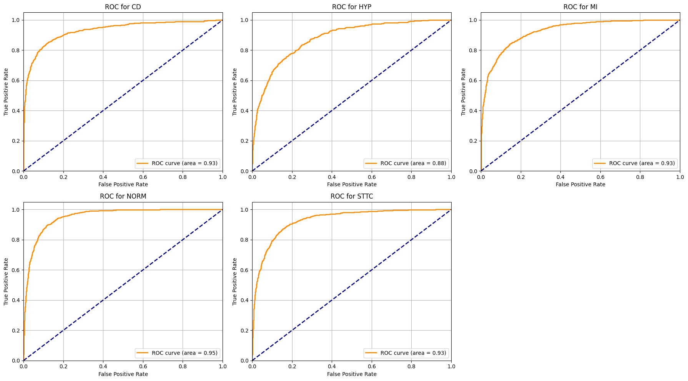
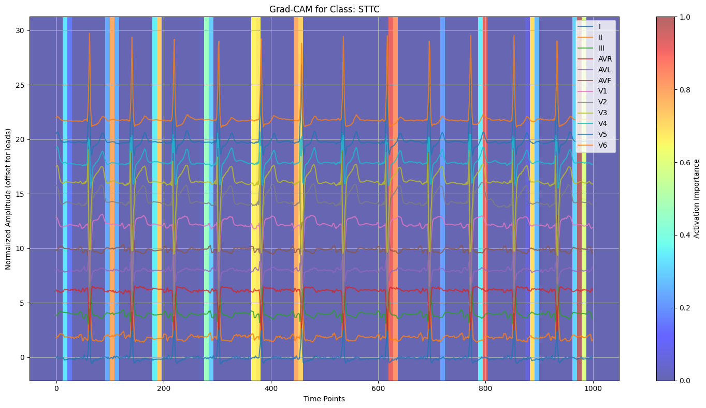
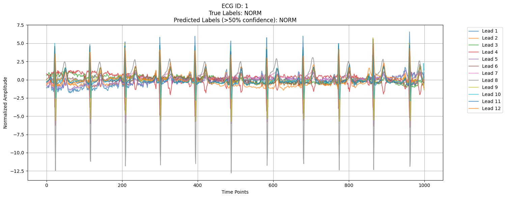

# ❤️ Explainable Multi-Label ECG Classification using 1D CNN on PTB-XL

## 📌 Overview
This project presents an end-to-end deep learning pipeline for multi-label ECG classification using the PTB-XL dataset. A 1D Convolutional Neural Network (CNN) was trained on 12-lead ECG signals to classify multiple cardiac diagnostic superclasses. Grad-CAM-based explainability was integrated to visualize the ECG regions influencing model predictions.

### 🚀 Project Highlights
- 🫀 12-Lead ECG Signal Classification
- 🤖 Deep Learning using TensorFlow/Keras
- 📈 Multi-label Cardiac Disease Prediction
- 🔍 Explainable AI using Grad-CAM
- ⚡ Memory-Optimized ECG Processing Pipeline
- 📊 Comprehensive Evaluation Metrics
- 🚀 Real-Time ECG Prediction System

---

## 👨‍💻 Author
**Md Affan**

---

# 📂 Dataset
Dataset Used:
- **PTB-XL: A Large Publicly Available ECG Dataset**

### 📦 Dataset Contents
- 21,837 clinical 12-lead ECG recordings
- 18,885 patients
- 10-second ECG signals
- 5 diagnostic superclasses

### 🩺 Diagnostic Superclasses

| Label | Description |
|---|---|
| NORM | Normal ECG |
| MI | Myocardial Infarction |
| STTC | ST/T Change |
| CD | Conduction Disturbance |
| HYP | Hypertrophy |

### 📁 Files Used
- `ptbxl_database.csv`
- `scp_statements.csv`
- Low-resolution ECG signal files (`filename_lr`)

---

# 🧠 Project Pipeline

```text
Raw ECG Signals
        ↓
Signal Loading using WFDB
        ↓
Preprocessing & Normalization
        ↓
One-Hot Label Encoding
        ↓
Train / Validation / Test Split
        ↓
1D CNN Model Training
        ↓
Evaluation Metrics
        ↓
Grad-CAM Explainability
        ↓
Real-Time ECG Prediction System
```

---

# 🧹 Data Preprocessing

## 📥 Data Loading
The following files were loaded:
- `ptbxl_database.csv`
- `scp_statements.csv`

Diagnostic superclasses were aggregated and one-hot encoded.

---

## ⚡ ECG Signal Loading & Normalization

Low-resolution ECG signals (`filename_lr`) were loaded using the `wfdb` library.

### ECG Signal Shape
```python
(21837, 1000, 12)
```

Where:
- `21837` → Total ECG records
- `1000` → Time samples
- `12` → ECG leads

## 📈 Sample ECG Waveform


### 📏 Normalization
Z-score normalization was applied across ECG leads and time dimensions.

---

## 🏷️ Label Encoding

Diagnostic superclasses were:
- Mapped to integer indices
- One-hot encoded into `y_labels`

### Label Shape
```python
(21837, 5)
```

---

# ✂️ Dataset Splitting

The dataset was split using stratified sampling.

| Dataset | Samples |
|---|---|
| Training | 15,285 |
| Validation | 2,184 |
| Testing | 4,368 |

### 📌 Split Ratio
```text
70% Training
10% Validation
20% Testing
```

---

# 🏗️ Model Architecture

The model is a **1D CNN** implemented using TensorFlow/Keras Functional API.

## 🔧 Architecture Components
- Conv1D Layers
- BatchNormalization
- ReLU Activation
- MaxPooling1D
- GlobalAveragePooling1D
- Dense Layer (64 Units)
- Dropout (0.5)
- L2 Regularization
- Sigmoid Output Layer

---

# ⚙️ Model Compilation

| Parameter | Value |
|---|---|
| Optimizer | Adam |
| Learning Rate | 0.0005 |
| Loss Function | Binary Crossentropy |
| Metrics | Accuracy, AUC |
| Output Activation | Sigmoid |

---

# 🛠️ Training Configuration

### 📌 Callbacks Used
- ReduceLROnPlateau
- EarlyStopping
- ModelCheckpoint

### Callback Settings
| Callback | Configuration |
|---|---|
| ReduceLROnPlateau | patience=3, factor=0.5 |
| EarlyStopping | patience=5 |
| ModelCheckpoint | `best_cnn_model.keras` |

### 🏋️ Training
The model was trained for:
```text
30 Epochs
```

---

# 📈 Training Results

## 📊 Training Curves

### 🔹 Accuracy & Loss Curves



---

# 📊 Model Evaluation

The best saved model (`best_cnn_model.keras`) was loaded for evaluation.

## 🏆 Final Performance Metrics

| Metric | Score |
|---|---|
| Micro F1-score | 0.7696 |
| Macro AUROC | 0.9248 |

---

## 📌 Classification Report

| Class | Precision | Recall | F1-score |
|---|---|---|---|
| CD | 0.83 | 0.71 | 0.77 |
| HYP | 0.69 | 0.40 | 0.51 |
| MI | 0.76 | 0.72 | 0.74 |
| NORM | 0.88 | 0.85 | 0.86 |
| STTC | 0.78 | 0.69 | 0.73 |

---

# 📉 Confusion Matrices




---

# 📈 ROC Curves


# 🔍 Explainable AI using Grad-CAM

Grad-CAM was implemented to improve model interpretability and visualize the ECG regions influencing predictions.

### 📌 Functions Implemented
- `make_gradcam_heatmap`
- `display_gradcam`

### 🎯 Grad-CAM Features
- Highlights important ECG regions
- Identifies influential leads
- Explains model predictions visually
- Improves trustworthiness of predictions

---

# 🌡️ Grad-CAM Visualizations

## 📌 Sample Grad-CAM Prediction




---

# 🚀 Real-Time ECG Prediction System

Two prediction functions were implemented:
- `ecg_detection_system`
- `ecg_detection_system_from_file_path`

These functions enable:
- Real-time ECG prediction
- ECG classification from custom file paths
- Deployment-ready inference pipeline

---

# 📌 Sample Predictions

## 🫀 ECG Prediction Example


---

# 💾 Model Saving

Final trained model:
```text
ECG_modelV2.keras
```

Saved to:
```text
Google Drive
```

---

# ⚡ Memory Optimization Techniques

To efficiently process the large ECG dataset:
- ✅ Low-resolution ECG signals were used
- ✅ NumPy pre-allocation was implemented
- ✅ In-place normalization was applied
- ✅ `tf.data.Dataset` pipelines were used
- ✅ Prefetching and batching optimized memory usage

These optimizations reduced RAM usage and prevented runtime crashes.

---

# 💻 Technologies Used

## 👨‍💻 Programming Language
- Python

## 📚 Libraries
- TensorFlow / Keras
- NumPy
- Pandas
- Matplotlib
- Seaborn
- WFDB
- Scikit-learn

---

# 📁 Project Structure

```text
├── data/
├── notebooks/
├── models/
├── images/
├── plots/
├── best_cnn_model.keras
├── ECG_modelV2.keras
├── README.md
```

---

# 🌟 Key Features

- 🫀 Multi-label ECG classification
- 📈 Biomedical signal processing
- 🔬 12-lead ECG analysis
- 🤖 Explainable AI integration
- 🔍 Grad-CAM visualization
- ⚡ Memory-efficient training pipeline
- 🚀 Real-time ECG prediction system

---

# 🚀 Future Improvements

Possible future enhancements:
- ResNet1D architecture
- CNN + BiLSTM hybrid models
- Transformer-based ECG models
- Focal loss for class imbalance
- External ECG dataset validation
- Lead-wise explainability analysis
- ECG report generation

---

# 🏥 Applications

Potential real-world applications:
- Automated cardiac diagnosis
- Clinical decision support systems
- Smart healthcare systems
- Remote ECG monitoring
- AI-assisted cardiology
- Emergency cardiac screening

---

# 📌 Conclusion

This project demonstrates an end-to-end deep learning framework for explainable ECG classification using the PTB-XL dataset. The 1D CNN model achieved strong performance with a Micro F1-score of 0.7696 and a Macro AUROC of 0.9248 while maintaining interpretability through Grad-CAM visualizations.

The project combines:
- Biomedical signal processing
- Deep learning
- Explainable AI
- Efficient data handling
- Real-time prediction systems

for clinically relevant ECG analysis.

---
